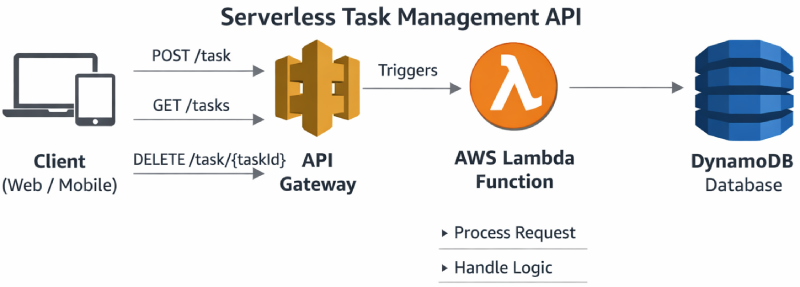

# aws-serverless-task-api

## Serverless Task Management API

This project demonstrates a serverless backend API built on Amazon Web Services using fully managed cloud services.

## Architecture flow

Client → API Gateway → AWS Lambda → DynamoDB

 

The client sends HTTP requests to API Gateway, which triggers a Lambda function to process the request. The Lambda function interacts with DynamoDB to store or retrieve task data.

## API Endpoints

| Method | Endpoint | Description |

|--------|----------|-------------|

| POST | `/task` | Create a task |

| GET | `/tasks` | Retrieve all tasks |

| DELETE | `/task/{taskId}` | Delete a task |

### Example POST request body

```json
{
  "task": "Learn AWS Lambda",
  "priority": "high",
  "completed": false
}
```

### Example POST response

```json
{
  "taskId": "uuid",
  "task": "Learn AWS Lambda",
  "priority": "high",
  "completed": false
}
```

## Technologies Used

Python

AWS Lambda

Amazon API Gateway

Amazon DynamoDB

IAM Roles and Policies

Amazon CloudWatch

## What I Learned

Building serverless applications using AWS managed services

Designing REST APIs with Amazon API Gateway

Connecting Lambda functions with DynamoDB for data persistence

Managing permissions using IAM roles and policies

Debugging and monitoring serverless applications using CloudWatch logs

## Future Improvements

- Add task update endpoint (PATCH /task/{taskId})
  
- Implement frontend UI hosted on S3
  
- Add authentication using Amazon Cognito
  
- Add filtering and querying for tasks

## Author
Joe Vonderlinden
